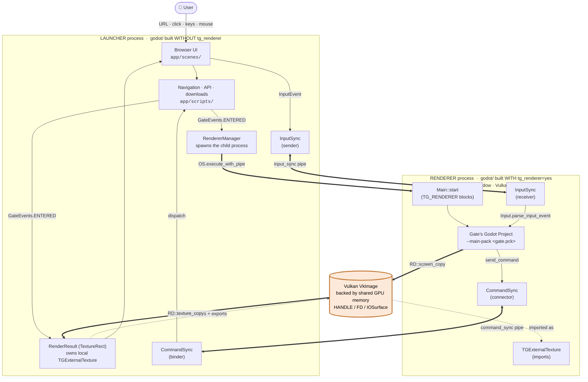
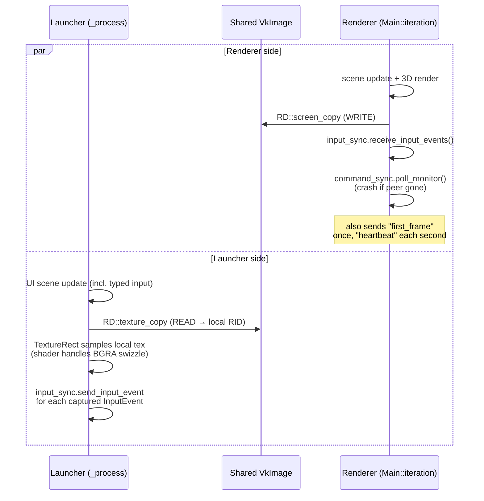

# Architecture Diagrams

Diagrams of the [[Two-Process Model]], rendered with [Mermaid](https://mermaid.js.org). Mermaid is the right pick here for three reasons:

1. **Agents read it natively.** It's plain text — no image decoding step.
2. **Obsidian renders it inline** out of the box; GitHub renders it in markdown previews; VS Code with the Mermaid Preview extension does too.
3. **Source diffs are meaningful** — you can review a diagram change in a normal PR.

If you ever want to edit one and see it interactively before committing, paste it into the [Mermaid Live Editor](https://mermaid.live).

---

## 1. System overview

The two processes, the IPC channels, and the shared GPU memory in one picture. This is the diagram to look at first.



**How to read it:**
- Solid arrows = data/control flow.
- `==>` thick arrows = the **frame data path** (renderer → shared GPU memory → launcher).
- `<==>` bidirectional thick = the **named-pipe IPC** channels.
- Dotted arrows around `SHARED` = **resource ownership** (the launcher *creates* the shared texture; the renderer *imports* it). Counterintuitive — see [[External Texture Sharing]] § "Why the launcher allocates."

---

## 2. Gate visit + handshake

How a single visit unfolds from URL entry to the first rendered frame. The handshake (allocate texture, spawn renderer, ferry the GPU handle, import) is the trickiest part of the system; this diagram walks it step by step.

```mermaid
sequenceDiagram
    autonumber
    actor U as User
    participant LU as Launcher UI
    participant RR as RenderResult<br/>(launcher)
    participant RM as RendererManager<br/>(launcher)
    participant R as Renderer Process<br/>(spawned)

    U->>LU: enter gate URL
    LU->>LU: download .gate, .pck, renderer binary

    Note over RR: launcher allocates the shared GPU memory
    LU->>RR: GateEvents.ENTERED
    RR->>RR: TGExternalTexture.new()
    RR->>RR: ext.create(format, view)
    Note right of RR: vmaCreateImage<br/>+ ExternalMemoryImageCreateInfo;<br/>vkGetMemoryWin32HandleKHR<br/>→ HANDLE

    LU->>RM: start_renderer(gate)
    RM->>R: OS.execute_with_pipe(renderer,<br/>[--main-pack, --resolution, --url])
    activate R

    R->>LU: connect command_sync, input_sync pipes
    R->>LU: cmd "ext_texture_format" [RGBA8 / BGRA8]
    LU->>RR: set_texture_format()<br/>(shader swizzle)

    R->>LU: cmd "send_filehandle" [path|my_pid]
    LU->>RR: send_filehandle(path)

    Note over RR,R: handle transfer (per-OS)
    RR->>R: Win: DuplicateHandle + pipe(int64)<br/>Mac: IOSurfaceID over pipe<br/>Linux: FD via flingfd

    R->>R: ext.recv_filehandle (BLOCKING)
    R->>R: ext.import(format, view)
    Note over RR,R: both processes now back<br/>the same VkImage memory

    loop each frame
        R->>R: render to hidden screen
        R->>R: ext.copy_from_screen()
        RR->>RR: ext.copy_to(local_rid)
        Note over RR: TextureRect updates
    end

    R->>LU: cmd "first_frame" (once)
    LU->>LU: fade in world view

    loop each ~1s
        R->>LU: cmd "heartbeat"
    end

    Note over R: if launcher pipe dies:<br/>CRASH_NOW (intentional cleanup)
```

**Things to notice:**
- The renderer is *spawned* (step 9) only after the launcher has *already* allocated the shared texture (step 6). The texture's lifetime is tied to the launcher, not the renderer.
- The renderer starts blocked on `recv_filehandle` (step 18) until the launcher pipes the handle. If the launcher dies between spawning and sending, the renderer hangs — that's why the heartbeat + intentional self-crash exists.
- The "handle transfer" is the only per-OS branch in the steady-state protocol. Everything else is identical Win/Mac/Linux. See [[Platform Differences]].

---

## 3. Per-frame loop

What's happening *every frame*, viewed as two parallel timelines. After the handshake completes, this is the entire steady state.



**The two sides do not synchronize per-frame.** The shared image is read/written without explicit Vulkan timeline semaphores in our code (we rely on the driver's implicit ordering for `RD::screen_copy` → `RD::texture_copy` across processes). Worth knowing if you ever see tearing or torn frames — would be the first place to add a fence.

---

## How to update these diagrams

- Edit the mermaid block in this file.
- Preview locally: open this note in Obsidian, or paste the block into [mermaid.live](https://mermaid.live).
- Keep diagram labels in sync with code-symbol names (e.g. if `RenderResult` gets renamed, both the diagram and the prose need updating). The diagrams are *load-bearing reference material*, not decorative.
- If a diagram grows past ~20 nodes, split it. Mermaid renders large graphs but they become unreadable. Better to have three focused diagrams than one sprawling one.
